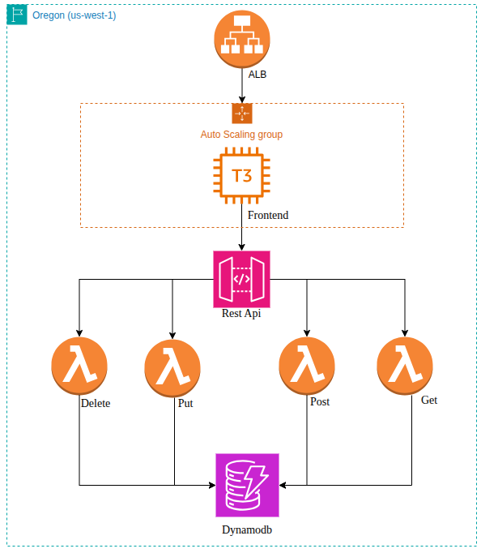

Makesure you create this app in Region us-west-2 (Oregon)

---

# Workflow for Building a Static Guestbook Website

This project is a digital guestbook used for a wedding reception. The application consists of:
1. Static Web Pages hosted on an AWS EC2 instance (t3.medium).
2. API Gateway to handle GET, POST, PUT, and DELETE requests.
3. AWS Lambda (Python) as the backend to process requests.
4. DynamoDB to store guest data.



---

## 1. Host the Static Website (EC2)
Steps:
1. Launch an EC2 instance (t3.medium) with amazon-linux-23 as the os.
2. Configure the instance Security Group to allow HTTP (port 80) and SSH (port 22).
3. SSH into the instance and install a web server (e.g., nginx or Apache).
   - Example for nginx on Ubuntu:
     sudo apt update && sudo apt install -y httpd
4. Upload `index.html`, `script.js`, and `style.css` to the web server document root (e.g., `/var/www/html` or `/usr/share/nginx/html`).
5. Start and enable the web server:
   sudo systemctl enable --now nginx
6. Ensure CORS is configured in your API (or set appropriate response headers) so the frontend can access the API.
7. (Optional) Allocate an Elastic IP and associate it with the instance for a stable public IP, or point a domain via Route53.

---

## 2. Create the API Gateway
API Gateway handles HTTP requests with the following endpoints:
| Method  | Endpoint             | Description                  |
|---------|----------------------|------------------------------|
| `GET`   | `/guests/`           | Retrieve all guests          |
| `POST`  | `/guests/`           | Add a new guest              |
| `PUT`   | `/guests/{id}`       | Update a guest's data        |
| `DELETE`| `/guests/{id}`       | Delete a guest               |

Update your `script.js` to include the API base URL.

---

## 3. Create Lambda Functions
Each HTTP method is connected to the following Lambda functions:
- `POST`: `lambda_add_guest.py`
- `GET`: `lambda_get_guests.py`
- `PUT`: `lambda_update_guest.py`
- `DELETE`: `lambda_delete_guest.py`

---

## 4. Store Data in DynamoDB
Create a DynamoDB table named `GuestBook` with:
- Partition Key: `id` (String)
- Additional attributes (optional): `nama`, `pesan`

Sample data structure:
```json
{
  "id": "1707898761",
  "nama": "Andi",
  "pesan": "Selamat menikah!"
}
```
